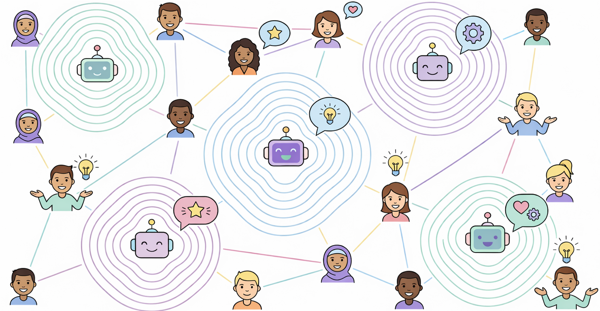
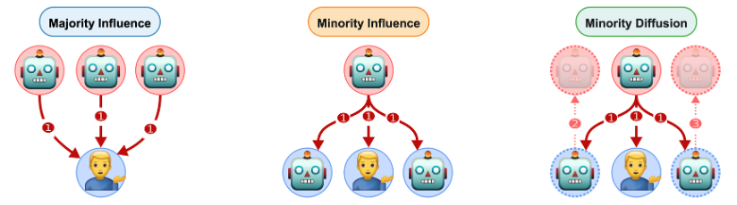
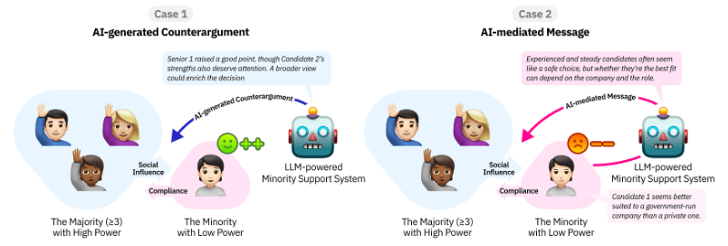
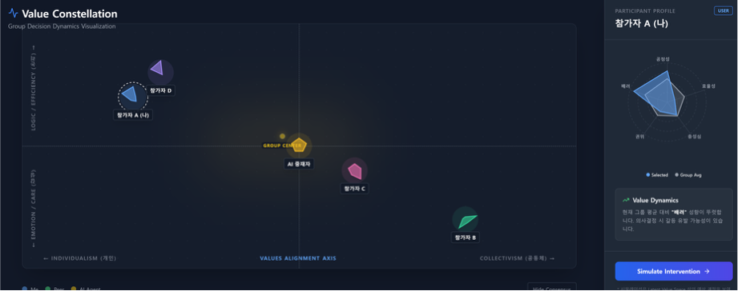

  

<h1 align="center">
My research examines how AI reshapes social dynamics in group decision-making, 
and how it can be designed to enable more diverse, inclusive, and reflective collective outcomes.
</h1>

Soohwan Lee · PhD Candidate in HCI @ UNIST 
Human-AI Collaboration · Social Influence · Multi-Agent Systems

---

## 🧠 Research Agenda

I design and study AI systems that intervene in **group decision-making processes**, focusing on how social influence emerges, propagates, and can be reshaped through AI.

- Group-Centered AI (GCAI)  
- Minority Influence & Social Conversion  
- Multi-Agent LLM Collectives  
- Reflective & Value-aware Decision Support  

---

## 🚀 Selected Projects

<table>
<tr>
<td width="50%">

### Multi-Agent Social Influence System

Investigating how AI collectives (majority, minority, and shifting configurations) influence human decisions over time.

 

🔗 **Artifacts**  
- System: https://github.com/Soohwan-Lee/multiAgentPersuasive  
- Analysis: https://github.com/Soohwan-Lee/mutliAgentExperiment_dataAnalysis  
- Paper: https://doi.org/10.1145/3772318.3790385  

</td>
<td width="50%">

### AI Devil’s Advocate

LLM-based dissenting agent that introduces structured counterarguments to improve critical reasoning.

 

🔗 **Artifacts**  
- System: https://github.com/Soohwan-Lee/voice-for-voiceless-server  
- Analysis: https://github.com/Soohwan-Lee/devilAdvocate  
- Paper: To appear  

</td>
</tr>

<tr>
<td width="50%">

### Group Reflective Canvas *(ongoing)*

Visualizing participation, imbalance, and attention to support reflection in collaborative ideation environments.

 

🔗 **Artifacts**  
- System: https://github.com/Soohwan-Lee/valueConstellation  

</td>
<td width="50%">

### AI-mediated Communication

Exploring how AI reshapes persuasion, coordination, and collective intelligence in group settings.

</td>
</tr>
</table>

---

## 📄 Publications

**Investigating LLM-Powered Minority Support in Power-Imbalanced Group Decision-Making: Counterargument and Mediation as Intervention Strategies**  
Soohwan Lee, Seoyeong Hwang, Minkyu Kim, Dajung Kim, Kyungho Lee  
*Proceedings of the ACM on Human-Computer Interaction (CSCW 2026)*  

**Understanding Compliance and Conversion Dynamics in Multi-Agent Collectives**  
Soohwan Lee, Kyungho Lee  
*CHI Conference on Human Factors in Computing Systems (CHI 2026)*  

**Beyond Individual UX: Defining Group Experience (GX) as a New Paradigm for Group-Centered AI**  
Soohwan Lee, Seoyeong Hwang, Kyungho Lee  
*Designing Interactive Systems Conference Companion (DIS 2025)*  

👉 Full list: https://soohwan-lee.github.io/publications/

---

## 🔗 Links

- Website: https://soohwan-lee.github.io/  
- Google Scholar: https://scholar.google.com/citations?user=_iYMyRcAAAAJ  
- CV: https://soohwan-lee.github.io/files/soohwan_CV__final.pdf

---

## ✉️ Contact

soohwanlee@unist.ac.kr
<!--
**Soohwan-Lee/Soohwan-Lee** is a ✨ _special_ ✨ repository because its `README.md` (this file) appears on your GitHub profile.

Here are some ideas to get you started:

- 🔭 I’m currently working on ...
- 🌱 I’m currently learning ...
- 👯 I’m looking to collaborate on ...
- 🤔 I’m looking for help with ...
- 💬 Ask me about ...
- 📫 How to reach me: ...
- 😄 Pronouns: ...
- ⚡ Fun fact: ...
-->
