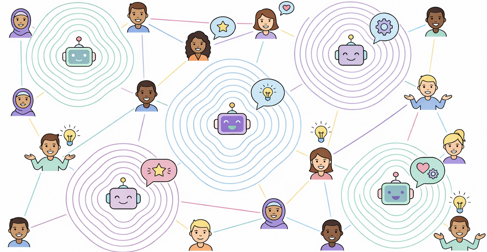
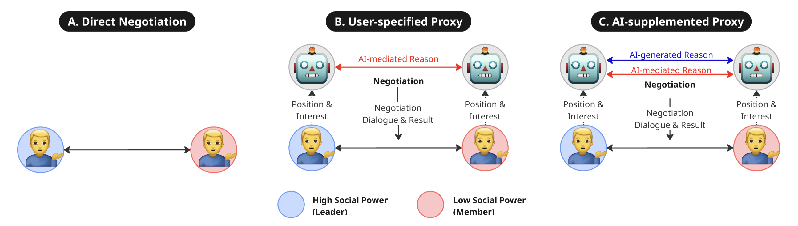
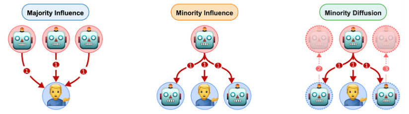
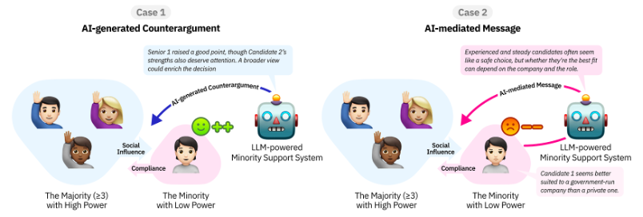
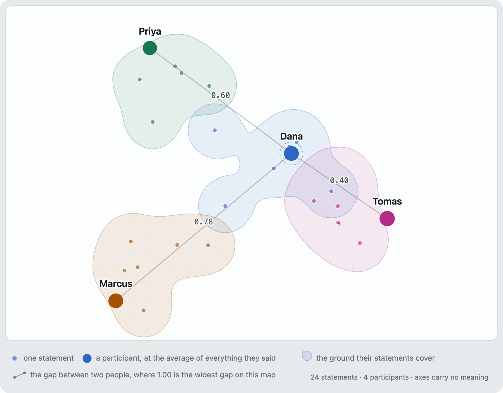

  

<h2 align="center">Soohwan Lee</h2>

PhD Candidate in Human-Computer Interaction, UNIST 
Human-AI Collaboration · Social Influence · Group Decision-Making

I study how AI systems change social dynamics in group decision-making, 
and how they can be designed to support more balanced and reflective collective outcomes.

---

## Research Interests

My work sits at the intersection of HCI, CSCW, and social psychology. I build AI systems that participate in group processes, run controlled experiments with them, and examine how social influence, power imbalance, and dissent play out when AI is in the loop.

- Group-centered AI and group experience (GX)
- Minority influence and dissent in AI-mediated groups
- Multi-agent LLM systems as social actors
- AI proxies and mediation in negotiation
- Reflective decision support for teams

---

## Selected Projects

<table>
<tr>

<td width="50%" valign="top">

### AI Proxies in Workplace Negotiation

A between-subjects experiment comparing direct negotiation with two forms of AI-proxy negotiation (user-specified vs. AI-supplemented) between leaders and members. Examines information disclosure, social cost, and satisfaction under power asymmetry.

[System](https://github.com/Soohwan-Lee/AI-Mediated-Negotiation-Experiment) · Paper (under review)

</td>

<td width="50%" valign="top">

### Social Influence by Multi-Agent Collectives

A longitudinal study of how LLM agent collectives in majority, minority, and shifting configurations affect human judgments, distinguishing compliance from conversion.

[System](https://github.com/Soohwan-Lee/multiAgentPersuasive) · [Data](https://github.com/Soohwan-Lee/mutliAgentExperiment_dataAnalysis) · [Paper](https://doi.org/10.1145/3772318.3790385)

</td>

</tr>
<tr>

<td width="50%" valign="top">

### LLM-Powered Minority Support in Group Decision-Making

An LLM agent that supports dissenting minorities in power-imbalanced groups through counterargument and mediation, evaluated in a group decision-making study.

[System](https://github.com/Soohwan-Lee/voice-for-voiceless-server) · [Data](https://github.com/Soohwan-Lee/devilAdvocate) · Paper (CSCW 2026, to appear)

</td>

<td width="50%" valign="top">

### Value Constellation *(ongoing)*

A transcript-to-map tool that places each meeting participant by what they said, showing how far apart people stand and on what ground. Built to support reflection in group deliberation.

[System](https://github.com/Soohwan-Lee/valueConstellation)

</td>

</tr>
</table>

---

## Links

- Website: https://soohwan-lee.github.io/
- CV: https://soohwan-lee.github.io/files/soohwan_CV__final.pdf
- Google Scholar: https://scholar.google.com/citations?user=_iYMyRcAAAAJ

## Contact

soohwanlee@unist.ac.kr
